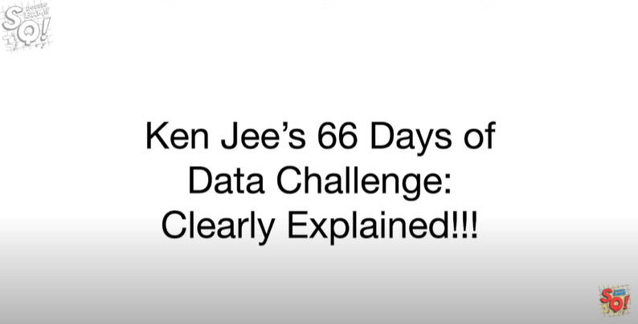

# 66 Days of Data by Dr. Joshua Starmer

> 🌍 Below repository contains the concepts and explainations provided by Dr. Joshua. I tried to collect all the information at one place for quick reference. 🌍

---
# Getting Started
---

> 🎥 Click the image above for a video!

## [Day1 of 66DaysOfData](https://www.linkedin.com/posts/joshua-starmer-phd-95a554130_66daysofdata-bam-activity-6816393714005544960-H2oX)

Diving into CatBoost. CatBoost converts categorical predictors into continuous predictors instead of using one-hot encoding.

  

## [Day2 of 66DaysOfData](https://www.linkedin.com/posts/joshua-starmer-phd-95a554130_66daysofdata-statquest-bam-activity-6816736668716978176-H_TL)

CatBoost has a unique boosting strategy (called Ordered Boosting) that separates the residuals associated with a row of training data from the trees that were built with that row of training data

  

## [Day3 of 66DaysOfData](https://www.linkedin.com/posts/joshua-starmer-phd-95a554130_66daysofdata-bam-activity-6817037032859197440-eVeq)

CatBoost does not use normal Decision Trees. Instead it uses Oblivious Decision Trees (ODTs). These are weaker learners (and boosting is all about weak learners) and very fast from a computation side of things.

  

## [Day4 of 66DaysOfData](https://www.linkedin.com/posts/joshua-starmer-phd-95a554130_66daysofdata-bam-activity-6817417262551633920-hO5G)

Although normal Decision Trees can handle relationships among features just fine, Oblivious Decision Trees do not. However, CatBoost uses Feature Combinations to try to deal with that.

  

## [Day5 of 66DaysOfData](https://www.linkedin.com/posts/joshua-starmer-phd-95a554130_66daysofdata-bam-activity-6817895670515609600-XGOd)

If you have a ton of data, building a tree with it all will take a long time. LightGBM reduces the amount of data used to build each tree using Gradient-based One-Side Sampling (GOSS) to speed things up!

  

## [Day6 of 66DaysOfData](https://www.linkedin.com/posts/joshua-starmer-phd-95a554130_66daysofdata-bam-activity-6818221056885624832-r3WK)

Because small residuals are under-reprsented in training datasets, small residuals are amplified by a weight when calculating Gain.

  

## [Day7 of 66DaysOfData](https://www.linkedin.com/posts/joshua-starmer-phd-95a554130_66daysofdata-bam-activity-6818608509215670272-vonm)

The more features you have, the longer it takes the train a tree. To reduce the number of features, features not declared as categorical that have relatively little overlap are merged via Exclusive Feature Bundling.

  

## [Day8 of 66DaysOfData](https://www.linkedin.com/posts/joshua-starmer-phd-95a554130_66daysofdata-bam-activity-6818894509536030721-6bgB)

LightGBM builds trees "leaf-wise", which, given restrictions on how big the tree can be, generally results in a more accurate tree. This is a big contrast to CatBoost which intentionally builds weaker trees.

  

## [Day9 of 66DaysOfData](https://www.linkedin.com/posts/joshua-starmer-phd-95a554130_66daysofdata-bam-activity-6819252799373656064-CYlv)

In contrast to both XGBoost and CatBoost, LightGBM has yet another way to deal with categorical features. I'm looking forward to doing a StatQuest video comparison of these three methods soon!

  

## [Day10 of 66DaysOfData](https://www.linkedin.com/posts/joshua-starmer-phd-95a554130_right-to-explanation-activity-6819575528434003968-gmIr)

The Right to Explanation - the legal right to be given an explanation for the output of an algorithm. For example, if you are rejected for a loan, you can demand an explanation, and this requires explainable AI.

[Right to explanation](https://en.wikipedia.org/wiki/Right_to_explanation)

## [Day11 of 66DaysOfData](https://www.linkedin.com/posts/joshua-starmer-phd-95a554130_66daysofdata-bam-activity-6820023684187648000-sjv6)

One step towards explaining machine learning results is calculating Shapley Values.

  

## [Day12 of 66DaysOfData](https://www.linkedin.com/posts/joshua-starmer-phd-95a554130_66daysofdata-bam-activity-6820429161958580225-cl6s)

Joshua naively thought that if he could calculate a Shapley Value for a 1 feature decision tree, he could do it with 2. Nope! However, this motivated creation of SHAP, which are used to explain ML.

  

## [Day13 of 66DaysOfData](https://www.linkedin.com/posts/joshua-starmer-phd-95a554130_66daysofdata-bam-activity-6820791056896991232-2GoV)

Joshua figured out how SHAP values are calculated for trees!!!

  

## [Day14-15 of 66DaysOfData](https://www.linkedin.com/posts/joshua-starmer-phd-95a554130_66daysofdata-bam-activity-6821540455231094785-QrfV)

A summary of the Main Ideas in SHAP!!!

  

  

  

  

  

  

